<h1 align="center">Hi 👋, I'm Tia Saxena👩🏽‍💻</h1>
<h3 align="center">Hopping in the tech world!</h3>

 

  

- 🌱 I’m currently learning **Backend Development**

- 👯 I’m looking to collaborate on **awesome project with awesome folks**

- 🤓 I’m brushing my **ReactJS skills**

- 💬 Ask me about **React, JavaScript**

- ⚡ Fun fact **I'm mostly confused when super excited.**

- 📫 How to reach me

    
  
  
  
  

 

 

  
Watch a snake 🐍 eating my GitHub contributions😯

  

